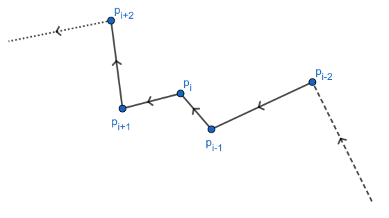

Universidade Federal de Alagoas – UFAL

Centro de Tecnologia – CTEC

Programa de Pós-Graduação em Engenharia Civil –  PPGEC

Cidade Universitária – Campus A. C. Simões 

Tabuleiro do Martins – CEP 57072-970 – Maceió –  Alagoas

Telefone: (82) 3214.1276 – Fax: (82)3214.1276 

Site: http://www.ctec.ufal.br/posgraduacao/ppgec/ 

*******

**Técnicas Computacionais Avançadas - 2018**

**Prof. William Wagner Matos Lira**

**Aluno: Weverton Marques da Silva**


# 3ª Lista de Exercícios (para 09/10/2018)

#### 1. Seja $P = p_1 p_2...p_n$ um polígono simples, orientado no sentido anti-horário. Suponha que o ângulo orientado de $p_{i–1}p_i$ para $p_ip_{i+1}$ é negativo. Mostre que $p_i$ não é vértice de $conv(P)$.  A recíproca é verdadeira?

> Se $conv(P)$ é convexo se, e somente se, todos os anĝnulo externos são **maiores** que 180°, em outras palavras: são positivos quando medido no sentido sentido anti-horário. Logo, os angulo externos de $P$ - como é o caso do ângulo orientado de $p_{i–1}p_i$ para $p_ip_{i+1}$ - são positivos. Dessa forma, $p_i$ não pode ser vértice de $conv(P)$. Por outro lado, a recíproca não é verdadeira sempre, vejamos na figura a seguir, onde temos o caso de um polígno simples, orientado no sentido anti-horário em $p_1$ não évérice de $conv(P)$ mas o ângulo orientado de $p_{i–1}p_i$ para $p_ip_{i+1}$ é positivo.
> 

#### 2. a) Mostre que o fecho convexo de um conjunto de pontos do plano é o polígono simples de maior área que contém o conjunto.

> Seja $P' = p_1p_2...p_ip_jp_k..p_n$ um polígono formado pelos pontos do fecho convexo de um conjunto de pontos $P$ com adição de mais um ponto, denotado por $p_j$ que pertença ao conjunto mas não ao fecho convexo. Uma vez que $p_j$ não é parte do fecho convexo, ele está dentro do fecho convexo, dessa forma o triângulo formado por $p_i$,$p_j$ e $p_k$ está contido no fecho convexo do conjunto, dessa forma a área de $P'$ é menor que a área do fecho convexo. Dessa forma, é impossível tomar um ponto do conjunto $P$ que não pertença a $conv(P)$ e obter um polígono de área maior que $P$. Conclusão: $conv(P)$ é o maior polígono que contém o conjunto de pontos.

#### b) Mostre que o fecho convexo de um conjunto de pontos do plano é o polígono simples de menor perímetro que contém o conjunto.

> Seja $P' = p_1p_2...p_ip_jp_k...p_n$ um polígono formado pelos pontos do fecho convexo de um conjunto de pontos $P$ com adição de mais um ponto, denotado por $p_j$ que pertença ao conjunto mas não ao fecho convexo. Uma vez que $p_j$ não é parte do fecho convexo, ele está dentro do fecho convexo, e para o triângulo formado por $p_i$,$p_j$ e $p_k$ vale a relação $\overline{p_ip_k} \le \overline{p_ip_j} + \overline{p_jp_k}$. Dessa forma, é impossível tomar um ponto do conjunto $P$ que não pertença a $conv(P)$ e obter um polígono de menor perímetro que $P$. Conclusão: $conv(P)$ é o polígono é de menor diâmetro que contém o conjunto de pontos.

#### 3. Sejam $p_1$, $p_2$, ..., $p_n$ pontos do plano. Descreva um algoritmo linear que, determina se $p_1$ é um vértice do fecho convexo de ${p_1, p_2, ..., p_n}$. [Sugestão: $p_1$ é vértice de $conv\{p_1, p_2, ..., p_n\}$ se e só se existe uma reta $r$ contendo $p_1$ tal que $p_2, ..., p_n$ estejam no mesmo semiplano determinado por $r$.]

```
Seja angulo(v) uma função que retorne o angulo de vetor v com a horizontal.
Seja anguloV(v1, v2) uma função que retorne o angulo entre os vetores v1 e v2, 
que pode ser dada por
    anguloV(v1, v2) = angulo(v1)-angulo(v2)

menor1 = angulo(P[2]-P[1])
i = 2
Para i = 3..n
    Se angulo(P[i]-P[1]) < menor, então
        menor = angulo(P[i]-P[1])
        menor_i = i
menor2 = angulo(P[2],P[menor_i])
Para i = 2..n
    Se angulo(P[i]-P[menor_i]) < menor, então
        menor = angulo(P[i]-P[menor_i])
Se menor <= 180°, então
    P[1] PERTENCE AO FECHO CONVEXO
Se não, então
    P[1] NÃO PERTENCE AO FECHO CONVEXO
```

#### 4. Considere a estrutura *winged-edge* apresentada.
##### a) Escreva um algoritmo que, dada uma face $F$, obtém seus vértices em tempo linear.

```
Seja F a face dada, e seja A a aresta associada a ela
proxima_Aresta <- A
Faça:
    Se F é a fccw de proxima_Aresta, então
        Adicione v1 a lista de vértice de F
        proxima_Aresta <- nccw de proxima_Aresta
    Se não, então
        Adicione v2 a lista de vértice de F
        proxima_Aresta <- ncw de proxima_Aresta
Até que proxima_Aresta == A
```

##### b) Escreva um algoritmo que, dado um vértice $v$, obtém todos os vértices adjacentes a $v$ em tempo linear.

```
Seja A a aresta associada ao vertice V
proxima_aresta <- A
Faça
    Se V == v1 de proxima_Aresta, então
        Adicione V2 a lista de vértices adjacentes a V
        Se houver (pccw de proxima_Aresta), então:
            proxima_aresta <- pccw de proxima_Aresta
        Senão, então
            Saia do loop
    Se não, então
        Adicione V2 a lista de vértices adjacentes a V
        Se houver (pcw de proxima_Aresta), então:
            proxima_aresta <- pcw de proxima_Aresta
        Senão, então
            Saia do loop
Até que proxima_Aresta == A
```

#### 5. Implemente o algoritmo de Jarvis para *FC2D*.

```python
def pseudoAngle(v1, v2):
    """Rerorna um pseudo-angle entre dois vetores v1 e v2
    """
    angle = 0
    n = 0
    for [x, y] in [v1, v2]:
        if (x > 0):
            if (y > 0):  # Primeiro quadrante
                if (x > y):
                    angleH = y / x  # angulo formado com a horizontal
                else:
                    angleH = 2 - x / y  # angulo formado com a horizontal
            else:  # Quarto quadrante
                if (x > -y):
                    angleH = 8 + y / x  # angulo formado com a horizontal
                else:
                    angleH = 6 - x / y  # angulo formado com a horizontal
        else:
            if (y > 0):  # Segundo quadrante
                if (-x > y):
                    angleH = 4 + y / x  # angulo formado com a horizontal
                else:
                    angleH = 2 - x / y  # angulo formado com a horizontal
            else:  # Terceiro quadrante
                if (x > y):
                    angleH = 6 - x / y  # angulo formado com a horizontal
                else:
                    angleH = 4 + y / x  # angulo formado com a horizontal
        angle = angle + ((-1)**n)*angleH
        n = n + 1
    return angle % 8


def nextPoint(p, i, direction):
    """Retorna o ID do próximo ponto do fecho convex do conunto p
    """
    lower = 8
    for j in range(0, len(p)):
        if j != i:
            angle = pseudoAngle([p[j][0]-p[i][0], p[j][1]-p[i][1]], direction)
            if (angle < lower):
                lower = angle
                index = j
    return index

def ordenate(point):
    """Retorna orenada do ponto
    """
    return point[1]

def jarvis_FC2D(p):
    """Determina o fecho convexo pelo algoritmo de Jarvis
    """
    chp = []  # Conjunto de pontos do fecho convexo
    chp.append(min(p, key=ordenate))  # Encontra o ponto de menor ordenada
    nextCHP = nextPoint(p, p.index(chp[0]), [1., 0.])
    chp.append(p[nextCHP])  # Adiciona o ponto ao fecho convexo
    i = 1
    while (chp[i] != chp[0]):
        direction = [chp[i][0]-chp[i-1][0], chp[i][1]-chp[i-1][1]]
        nextCHP = nextPoint(p, nextCHP, direction)
        chp.append(p[nextCHP])
        i = i + 1
    return chp
```
 